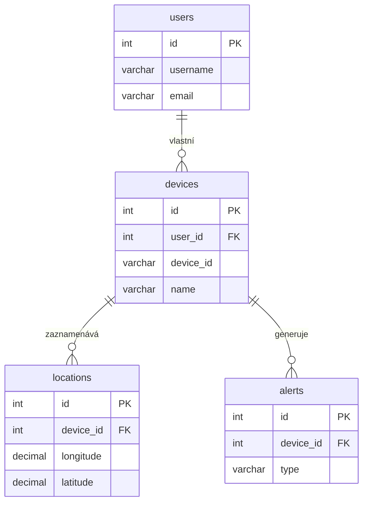

# 2. Databáze

Tento dokument detailně popisuje databázové schéma, jednotlivé tabulky (modely) a jejich vzájemné vztahy.

## 2.1. Přehled

- **Systém**: MySQL
- **ORM**: Sequelize
- **Inicializace**: Schéma databáze a základní data jsou definovány v souboru `init-db.sql`, který se automaticky spouští při prvním startu `mysql` kontejneru v Dockeru.

## 2.2. Schéma a modely

Následuje popis jednotlivých tabulek a jejich reprezentace v Sequelize modelech.

### Tabulka `users`

Ukládá informace o uživatelských účtech.

- **Model**: `models/user.js`
- **Klíčové sloupce**:
  - `id`: Primární klíč (PK).
  - `username`, `email`: Unikátní identifikátory uživatele.
  - `password`: Hashované heslo pro lokální účty.
  - `is_verified`: Flag, zda byl e-mail uživatele ověřen.
  - `provider`, `provider_id`: Sloupce pro ukládání informací o přihlášení přes třetí strany (OAuth), např. `google` nebo `github`.

### Tabulka `devices`

Obsahuje informace o registrovaných GPS zařízeních.

- **Model**: `models/device.js`
- **Klíčové sloupce**:
  - `id`: Primární klíč (PK).
  - `user_id`: Cizí klíč (FK) odkazující na `users.id`. Určuje, komu zařízení patří.
  - `device_id`: Unikátní 10místný identifikátor samotného hardwaru.
  - `name`: Uživatelsky definovaný název zařízení.
  - `status`: Stav zařízení (`active`, `inactive`).
  - `interval_gps`, `interval_send`, `satellites` : Konfigurace intervalů pro sledování a odesílání dat.
  - `geofence`: Pole typu `JSON` pro uložení souřadnic geografické ohrady.

### Tabulka `locations`

Ukládá jednotlivé záznamy o poloze z GPS zařízení.

- **Model**: `models/location.js`
- **Klíčové sloupce**:
  - `id`: Primární klíč (PK).
  - `device_id`: Cizí klíč (FK) odkazující na `devices.id`.
  - `longitude`, `latitude`: Zeměpisné souřadnice.
  - `timestamp`: Časová značka záznamu.
  - `speed`, `altitude`, `accuracy`, `satellites`: Doplňující data z GPS modulu.

### Tabulka `alerts`

Záznamy o vygenerovaných poplaších (např. při opuštění geofence).

- **Model**: `models/alert.js`
- **Klíčové sloupce**:
  - `id`: Primární klíč (PK).
  - `device_id`: Cizí klíč (FK) odkazující na `devices.id`.
  - `type`: Typ poplachu (např. `geofence`).
  - `message`: Text poplachu.
  - `is_read`: Flag, zda si uživatel poplach přečetl.

## 2.3. Vztahy mezi modely (Asociace)

Vztahy jsou definovány v `associate` metodách jednotlivých modelů a zajišťují integritu dat.

- **`User` 1 : N `Device`**: Jeden uživatel může vlastnit více zařízení.
- **`Device` 1 : N `Location`**: Jedno zařízení může mít mnoho záznamů o poloze.
- **`Device` 1 : N `Alert`**: K jednomu zařízení se může vázat více poplachů.

**Kaskádové mazání (`ON DELETE CASCADE`)**: Díky tomuto nastavení na úrovni databáze i Sequelize modelů se při smazání uživatele automaticky smažou všechna jeho zařízení a následně i všechny jejich lokace a poplachy. Tím je zajištěna konzistence dat.
