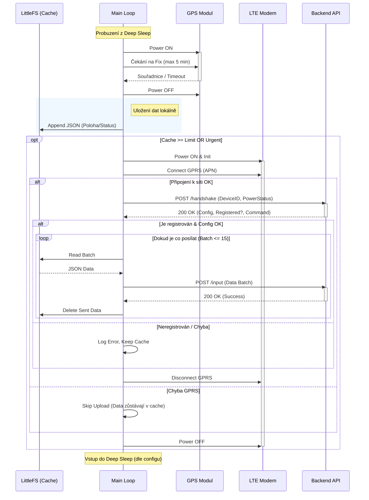

## Tok dat (Sequence Diagram)

```mermaid
sequenceDiagram
    participant Cache as LittleFS (Cache)
    participant App as Main Loop
    participant GPS as GPS Modul
    participant Modem as LTE Modem
    participant Server as Backend API

    Note over App: Probuzení z Deep Sleep

    %% 1. GPS Fáze
    App->>GPS: Power ON
    activate GPS
    App->>GPS: Čekání na Fix (max 5 min)
    GPS-->>App: Souřadnice / Timeout
    deactivate GPS
    App->>GPS: Power OFF
    
    rect rgb(240, 248, 255)
        Note right of App: Uložení dat lokálně
        App->>Cache: Append JSON (Poloha/Status)
    end

    %% 2. Modem Fáze
    opt Cache >= Limit OR Urgent
        App->>Modem: Power ON & Init
    activate Modem
    App->>Modem: Connect GPRS (APN)
    
    alt Připojení k síti OK
        %% Handshake
        App->>Server: POST /handshake (DeviceID, PowerStatus)
        activate Server
        Server-->>App: 200 OK (Config, Registered?, Command)
        deactivate Server

        alt Je registrován & Config OK
            loop Dokud je co posílat (Batch <= 15)
                App->>Cache: Read Batch
                Cache-->>App: JSON Data
                App->>Server: POST /input (Data Batch)
                activate Server
                Server-->>App: 200 OK (Success)
                deactivate Server
                App->>Cache: Delete Sent Data
            end
        else Neregistrován / Chyba
            App->>App: Log Error, Keep Cache
        end
        
        App->>Modem: Disconnect GPRS
    else Chyba GPRS
        App->>App: Skip Upload (Data zůstávají v cache)
    end

        App->>Modem: Power OFF
        deactivate Modem
    end

    Note over App: Vstup do Deep Sleep (dle configu)
```
