# Životní cyklus zařízení (State Diagram)

Tento diagram vizualizuje kompletní stavový automat firmwaru, včetně rozhodovacích procesů při startu, během pracovního cyklu a při uspávání.

```mermaid
stateDiagram-v2
    %% --- Počáteční stav ---
    [*] --> Boot : Připojení baterie / Timer / Tlačítko

    %% --- Bootovací sekvence ---
    state "Boot Sequence" as Boot {
        Power_Latch : Aktivace PIN_EN (Hold Power)
        Check_Button : Kontrola tlačítka (GPIO32)
        
        state button_decision <<choice>>
        
        Power_Latch --> Check_Button
        Check_Button --> button_decision
    }

    button_decision --> OTA_Mode : Dlouhý stisk (> 2s)
    button_decision --> Active_Cycle : Žádný stisk / Krátký stisk

    %% --- OTA Režim ---
    state "OTA / Service Mode" as OTA_Mode {
        Start_WiFi : Start AP (lotrTrackerOTA_...)
        Web_Server : Běží HTTP Server (Config/FW)
        
        Start_WiFi --> Web_Server
        Web_Server --> Web_Server : Čekání na uživatele
    }
    %% Z OTA se vystupuje jen restartem (není v diagramu automatu)

    %% --- Hlavní pracovní cyklus ---
    state "Active Work Cycle" as Active_Cycle {
        
        %% 1. Inicializace
        state "Init System" as Init {
            Mount_FS : Mount LittleFS
            Load_Config : Načtení Preferences
        }

        %% 2. GPS Fáze
        state "GPS Acquisition" as GPS_Phase {
            GPS_On : Power UP GPS
            Wait_Fix : Čekání na souřadnice (max 5 min)
            GPS_Off : Power DOWN GPS
            
            GPS_On --> Wait_Fix
            Wait_Fix --> GPS_Off : Fix OK nebo Timeout
        }

        %% 3. Ukládání
        state "Data Caching" as Cache_Phase {
            Save_Local : Uložení JSON do LittleFS
        }

        %% 4. Modem Fáze
        state "Modem & Network" as Modem_Phase {
            Modem_Init : Init UART & Power
            Connect_GPRS : Připojení k APN
            
            state "Server Communication" as Server_Comm {
                Handshake : POST /handshake
                Check_Reg : Kontrola registrace
                Upload : Upload dávek (max 15 záznamů na 1 POST")
                Server_Cmd : Zpracování příkazů (TURN_OFF / Config)
                
                Handshake --> Check_Reg
                Check_Reg --> Upload : Registrováno
                Check_Reg --> End_Session : Neregistrováno (Error)
                Upload --> Server_Cmd
            }
            
            Modem_Stop : Disconnect & Power OFF

            Modem_Init --> Connect_GPRS
            Connect_GPRS --> Handshake : Úspěch
            Connect_GPRS --> Modem_Stop : Chyba sítě
            Server_Cmd --> Modem_Stop
            End_Session --> Modem_Stop
        }

        Init --> GPS_Phase
        GPS_Phase --> Cache_Phase
        Cache_Phase --> Modem_Phase
    }

    %% --- Ukončovací stavy ---
    state end_decision <<choice>>
    
    Active_Cycle --> end_decision : Cyklus dokončen
    
    state "Deep Sleep" as Sleep {
        Timer_Set : Nastavení timeru (např. 60s)
        Go_Sleep : esp_deep_sleep_start()
    }

    state "Power OFF (Shutdown)" as Shutdown {
        Cleanup : Uzavření FS, Stop Modem
        Cut_Power : PIN_EN = LOW
    }

    %% Logika přechodů na konci cyklu
    end_decision --> Sleep : Je registrován
    end_decision --> Shutdown : Není registrován OR Příkaz TURN_OFF

    %% Globální přerušení
    note right of Shutdown
        Graceful Shutdown lze vyvolat
        kdykoliv tlačítkem (GPIO32)
        během Active_Cycle.
    end note

    Active_Cycle --> Shutdown : Interrupce tlačítkem (Graceful)
    OTA_Mode --> Shutdown : Interrupce tlačítkem (Graceful)
    Sleep --> Boot : Wakeup Timer / Button
```

## Popis stavů

### 1. Boot Sequence
Po probuzení procesor "podrží" napájení (Power Latch). Pokud uživatel drží tlačítko, přechází se do **OTA režimu** (servisní Wi-Fi). Jinak pokračuje standardní program.

### 2. Active Work Cycle
Hlavní smyčka programu:
1.  **GPS:** Pokus o získání polohy. I když se nezdaří (timeout), vytvoří se záznam (bez souřadnic nebo s posledními známými) a proces pokračuje.
2.  **Cache:** Data se uloží do souboru v `LittleFS`. To zajišťuje, že se data neztratí při výpadku sítě.
3.  **Modem:**
    *   **Handshake:** Klíčový krok. Server potvrdí, že zařízení zná (`registered: true`) a může poslat novou konfiguraci.
    *   **Upload:** Data se posílají po dávkách. Pokud je záznamů více, odesílají se postupně v jedné relaci.
    *   **Příkazy:** Pokud server odpoví instrukcí `TURN_OFF`, zařízení se připraví na úplné vypnutí.

### 3. Deep Sleep vs. Shutdown
*   **Deep Sleep:** Standardní stav mezi měřeními. RAM je smazána, ale RTC paměť běží (časovač). Spotřeba v řádu µA.
*   **Shutdown:** Úplné odpojení baterie (pokud to HW dovoluje přes Latch obvod) nebo trvalý spánek bez časovače. Nastává, pokud zařízení není registrováno v systému nebo uživatel stiskl tlačítko pro vypnutí.
