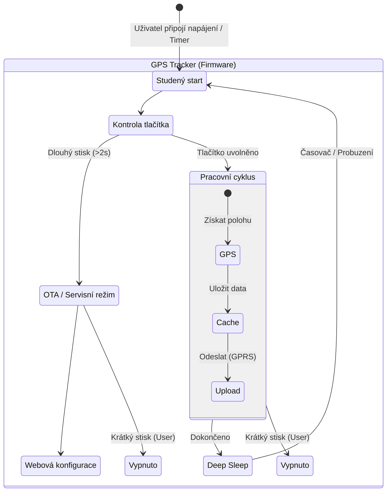

# Use Case Diagram - Funkčnost zařízení SIMPLE

## Detailní popis scénářů

### 1. Start a Servisní režim (OTA)
- **Start:** Po připojení napájení (`PIN_EN`) se provede inicializace.
- **Detekce módu:** Firmware okamžitě kontroluje stav tlačítka (`GPIO32`).
    - Pokud je tlačítko drženo **déle než 2 sekundy**, zařízení startuje Wi-Fi AP (SSID: `lotrTrackerOTA_...`).
    - Uživatel se může připojit a přes webové rozhraní nastavit APN, server nebo nahrát nový firmware.

### 2. Běžný provoz (Work Cycle)
Pokud není detekován servisní režim, zařízení vstupuje do smyčky:
1.  **GPS:** Zapne modul, čeká na fix (max 5 min), získá souřadnice.
2.  **Cache:** Data uloží do interní paměti (`LittleFS`).
3.  **GPRS:** Zapne modem, připojí se k síti.
4.  **Upload:**
    - Provede **Handshake** (ověření registrace).
    - Odesílá data v dávkách (max 15 záznamů).
    - Přijímá příkazy ze serveru (např. změna intervalu nebo příkaz k vypnutí).
5.  **Spánek:** Po dokončení přejde do `Deep Sleep` na nastavenou dobu (default 60s).

### 3. Vypnutí (Graceful Shutdown)
- Uživatel může kdykoliv za běhu krátce stisknout tlačítko.
- Zařízení dokončí kritické operace (zápis na disk), korektně odpojí síť a vypne se.
