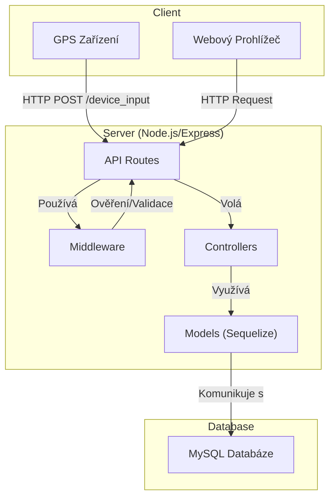
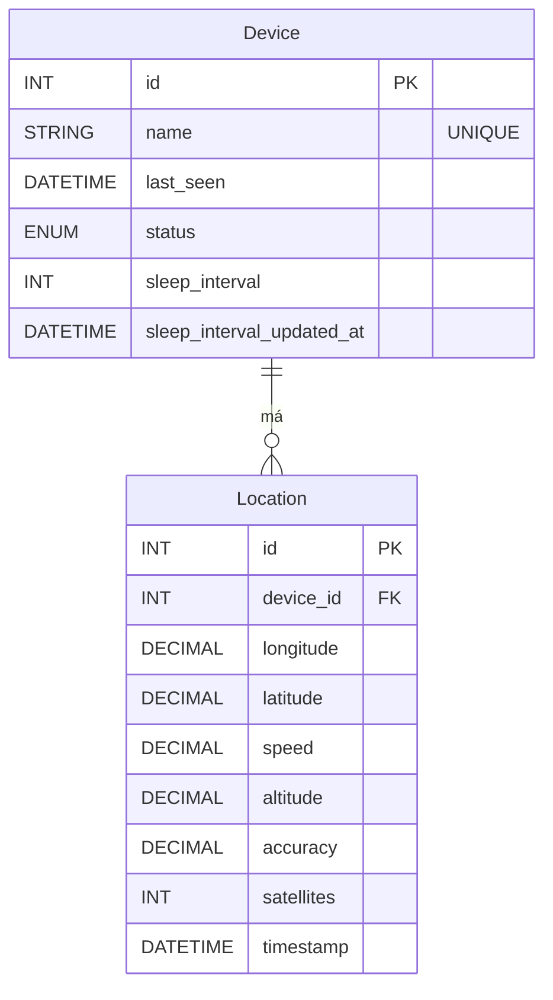

# GPS Tracking Server (Node.JS)

Tento dokument popisuje architekturu, strukturu a fungování NodeJS serveru pro GPS sledování.

## Obsah

- [Architektura](#architektura)
- [Struktura Projektu](#struktura-projektu)
- [Databáze](#databáze)
  - [Schéma Databáze](#schéma-databáze)
- [API Endpoints](#api-endpoints)
- [Instalace a Spuštění](#instalace-a-spuštění)
  - [Předpoklady](#předpoklady)
  - [Instalace](#instalace)
  - [Konfigurace](#konfigurace)
  - [Spuštění](#spuštění)

## Architektura

Server je postaven na Node.js s využitím Express.js frameworku. Pro komunikaci s databází využívá Sequelize ORM. Architektura je navržena tak, aby oddělovala jednotlivé části aplikace (routy, controllery, modely).



## Struktura Projektu

Projekt má následující adresářovou strukturu:

```
Server_NODEJS/
├── config/               # Konfigurační soubory (např. pro autentizaci)
├── controllers/          # Controllery - obsahují logiku aplikace
├── middleware/           # Middleware funkce (např. ověření uživatele)
├── models/               # Sequelize modely definující strukturu databáze
├── public/               # Statické soubory (CSS, JS, obrázky)
├── routes/               # Definuje cesty (endpoints) aplikace
├── views/                # EJS šablony pro generování HTML stránek
├── database.js           # Nastavení připojení k databázi (Sequelize)
├── package.json          # Seznam závislostí a skriptů projektu
├── server.js             # Hlavní soubor aplikace, startuje server
└── ...
```

- **`config/`**: Uchovává konfigurační soubory, jako jsou nastavení pro autentizaci.
- **`controllers/`**: Obsahuje obchodní logiku. Funkce v controllerech jsou volány z rout a starají se o zpracování požadavků.
- **`middleware/`**: Zde jsou definovány Express middleware, například pro ověření, zda je uživatel přihlášen (`isAuthenticated.js`).
- **`models/`**: Definuje databázové modely pomocí Sequelize. Každý soubor reprezentuje jednu tabulku v databázi.
- **`public/`**: Obsahuje statické soubory, které jsou přímo přístupné z webového prohlížeče (styly, klientské skripty, obrázky).
- **`routes/`**: Definuje API endpointy. Přiřazuje URL adresy k příslušným controllerům.
- **`views/`**: Obsahuje soubory šablon (`.ejs`), které server používá k renderování dynamických HTML stránek.
- **`database.js`**: Inicializuje připojení k databázi pomocí Sequelize a načítá všechny modely.
- **`server.js`**: Vstupní bod aplikace. Nastavuje Express server, registruje middleware, routy a spouští aplikaci.

## Databáze

Aplikace používá MySQL databázi, ke které přistupuje pomocí Sequelize ORM. Schéma se skládá ze dvou hlavních tabulek: `devices` a `locations`.

### Schéma Databáze



- **`Device`**: Reprezentuje sledované zařízení.
- **`Location`**: Uchovává jednotlivé záznamy o poloze pro dané zařízení. Mezi `Device` a `Location` je vztah 1:N (jedno zařízení může mít mnoho záznamů o poloze).

## API Endpoints

Server poskytuje následující hlavní endpointy:

### Nechráněné (bez autentizace)
- `POST /device_input`: Přijímá data o poloze z GPS zařízení.
- `GET /device_settings/:device`: Vrací nastavení pro konkrétní zařízení (např. interval spánku).
- `POST /device_settings`: Aktualizuje nastavení pro konkrétní zařízení.
- `GET /login`: Zobrazí přihlašovací stránku.
- `POST /login`: Zpracuje přihlášení uživatele.

### Chráněné (vyžaduje autentizaci)
- `GET /`: Zobrazí hlavní stránku s mapou.
- `GET /device`: Zobrazí stránku s detaily o zařízení.
- `GET /current_coordinates`: Vrací aktuální souřadnice všech zařízení (pro AJAX na mapě).
- `GET /device_data`: Vrací historická data pro zařízení.
- `DELETE /api/device/:deviceName`: Smaže zařízení a všechna jeho data.
- `GET /settings`: Zobrazí stránku s nastavením uživatele.
- `POST /settings/change-password`: Umožní přihlášenému uživateli změnit si heslo.
- `GET /logout`: Odhlásí uživatele.

## Instalace a Spuštění

### Předpoklady

- [Node.js](https://nodejs.org/) (verze 14 nebo vyšší)
- [MySQL](https://www.mysql.com/) databáze

### Instalace

1.  Naklonujte repozitář (pokud je v gitu) nebo zkopírujte soubory do složky.
2.  Přejděte do adresáře `Server_NODEJS`:
    ```bash
    cd Server_NODEJS
    ```
3.  Nainstalujte závislosti pomocí npm:
    ```bash
    npm install
    ```

### Konfigurace

1.  Vytvořte soubor `.env` v kořenovém adresáři `Server_NODEJS`.
2.  Zkopírujte do něj obsah z `.env.example` (pokud existuje) nebo jej vytvořte podle následující šablony:

    ```env
    # Server Configuration
    PORT=5000
    SESSION_SECRET='vase_tajne_heslo_pro_session'
    NODE_ENV=development # 'production' or 'development'
    CORS_ORIGIN='http://localhost:5000' # Nebo adresa vaší webové aplikace
    RATE_LIMIT_MAX=100

    # Database Configuration
    DB_HOST=localhost
    DB_USER=root
    DB_PASSWORD=vase_heslo
    DB_NAME=gps_tracker
    DB_PORT=3306

    # Credentials for web interface login (needs to be hashed with bcrypt)
    ADMIN_USERNAME=admin
    ADMIN_PASSWORD_HASH=hash_vaseho_hesla
    ```

3.  Ujistěte se, že máte vytvořenou databázi a uživatele v MySQL s právy k této databázi.

### Spuštění

-   **Pro vývoj (s automatickým restartem při změně souboru):**
    ```bash
    npm run dev
    ```
-   **Pro produkční prostředí:**
    ```bash
    npm start
    ```

Server poběží na adrese `http://localhost:5000` (nebo na portu definovaném v `.env`). 