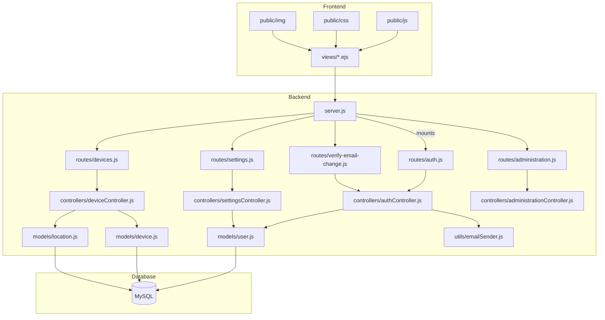
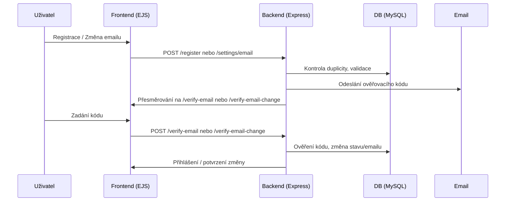

# GPS Server NodeJS

## Struktura projektu

```

# GPS Server NodeJS

## Struktura projektu



## Uživatelský flow



## Podrobnosti funkcí

- **Registrace uživatele**
│   ├── authController.js
│   ├── deviceController.js
│   ├── indexController.js
│   ├── settingsController.js
├── middleware/
│   ├── authorization.js
├── models/
│   ├── device.js
│   ├── location.js
│   ├── user.js
│   ├── css/
│   ├── img/
│   ├── js/
├── routes/
│   ├── auth.js
│   ├── devices.js
│   ├── register-device.js
│   ├── settings.js
│   ├── verify-email-change.js
│   ├── generate-hash.js
│   ├── hash-password.js
│   ├── testy.py
│   ├── emailSender.js
├── views/
│   ├── partials/
├── database.js
├── docker-compose.yml
├── dockerfile
├── init-db.sql
├── server.js
```

## Funkčnost serveru

- **Přihlášení**: Přes email nebo uživatelské jméno, kontrola hesla.
- **Změna emailu**: Odeslání ověřovacího kódu na nový email, změna emailu až po ověření kódu.
- **Správa zařízení**: Přidání, odebrání, správa zařízení (deviceController).
- **Administrace**: Správa uživatelů, role root, omezení mazání root účtu.
- **Ověření emailu**: Moderní UI pro zadání kódu (4 pole), automatické přeskočení mezi poli.
- **Bezpečnost**: Hashování hesel (bcryptjs), validace vstupů, session, rate limiting.
- **Email**: Odesílání přes Gmail SMTP (Nodemailer, utils/emailSender.js).
- **Frontend**: EJS šablony, Bootstrap.
- **Docker**: docker-compose pro spuštění serveru a databáze.

## Spuštění

1. Inicializace databáze:
   - Spusťte SQL skript `init-db.sql` v MySQL.
2. Instalace závislostí:
   - `npm install`
3. Spuštění serveru:
   - `node server.js` nebo přes Docker Compose
4. Přístup:
   - Webové rozhraní na `http://localhost:5000`
- `init-db.sql` – inicializace databáze
- `utils/emailSender.js` – odesílání emailů
- Root účet nelze smazat přes administraci.
---
Tento soubor shrnuje strukturu a hlavní funkce serveru. Pro detailní popis jednotlivých částí viz komentáře v kódu.
