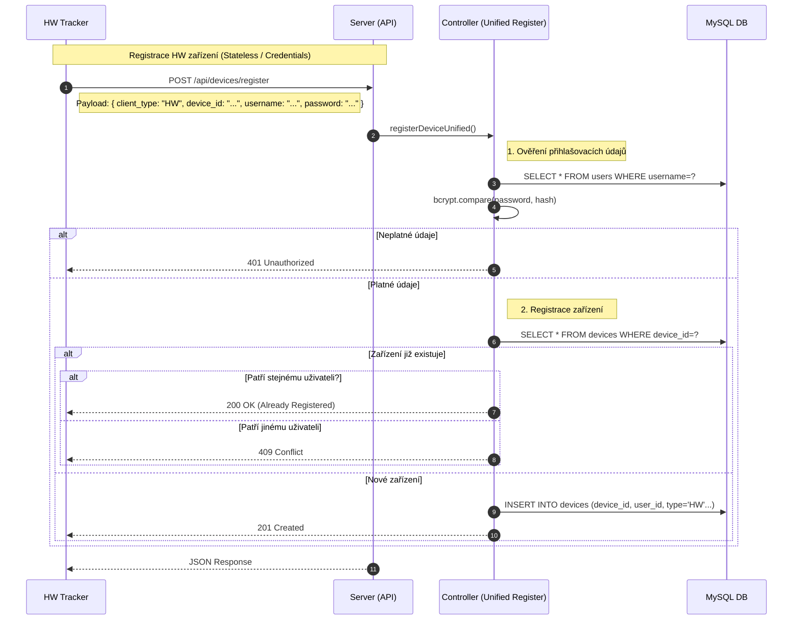

```mermaid
sequenceDiagram
    autonumber
    participant HW as HW Tracker
    participant API as Server (API)
    participant Logic as Controller (Unified Register)
    participant DB as MySQL DB

    Note over HW, API: Registrace HW zařízení (Stateless / Credentials)

    HW->>API: POST /api/devices/register
    Note right of HW: Payload: { client_type: "HW", device_id: "...", username: "...", password: "..." }

    API->>Logic: registerDeviceUnified()

    Note right of Logic: 1. Ověření přihlašovacích údajů
    Logic->>DB: SELECT * FROM users WHERE username=?
    Logic->>Logic: bcrypt.compare(password, hash)
    
    alt Neplatné údaje
        Logic-->>HW: 401 Unauthorized
    else Platné údaje
        Note right of Logic: 2. Registrace zařízení
        Logic->>DB: SELECT * FROM devices WHERE device_id=?
        
        alt Zařízení již existuje
            alt Patří stejnému uživateli?
                Logic-->>HW: 200 OK (Already Registered)
            else Patří jinému uživateli
                Logic-->>HW: 409 Conflict
            end
        else Nové zařízení
            Logic->>DB: INSERT INTO devices (device_id, user_id, type='HW'...)
            Logic-->>HW: 201 Created
        end
    end
    API-->>HW: JSON Response
```