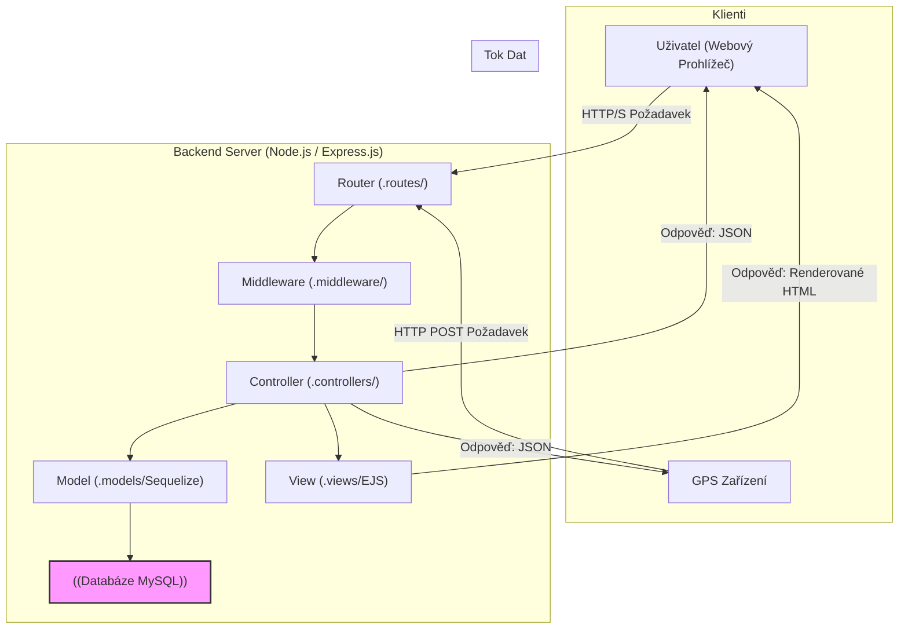
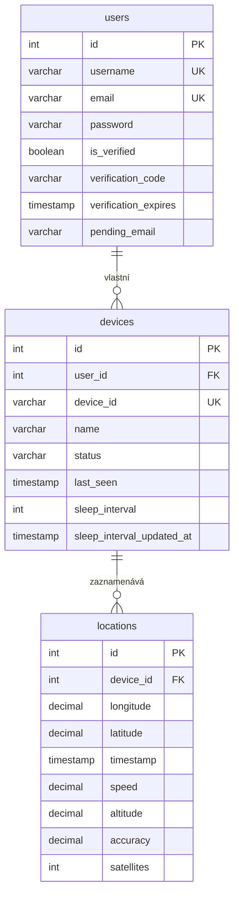

# Rozšířená Analýza a Dokumentace Serveru

Tento dokument poskytuje hloubkovou technickou analýzu a dokumentaci k serverové části aplikace pro sledování GPS. Popisuje architekturu, datový model, API endpointy a klíčové funkcionality systému.

## 1. Přehled

Server je postaven na platformě **Node.js** s využitím frameworku **Express.js**. Jeho primárním úkolem je sloužit jako backend pro GPS sledovací systém. Zajišťuje příjem a zpracování dat z GPS zařízení, správu uživatelských účtů a zařízení, a poskytuje rozhraní pro vizualizaci a management dat.

### 1.1. Technologický Stack

- **Backend:** Node.js, Express.js
- **Databáze:** MySQL
- **ORM (Object-Relational Mapping):** Sequelize
- **Šablonovací systém:** EJS (Embedded JavaScript templates)
- **Autentizace:** Express Session, bcryptjs pro hashování hesel
- **Validace:** express-validator
- **Odesílání e-mailů:** Nodemailer
- **Vývojové prostředí:** Nodemon pro automatické restartování serveru

## 2. Architektura a Tok Dat

Aplikace dodržuje osvědčený vzor Model-View-Controller (MVC), který odděluje datovou logiku, prezentační vrstvu a řídící logiku.

### 2.1. Diagram Architektury



## 3. Databázové Schéma



- **Vztahy:**
  - `users` 1--N `devices`: Jeden uživatel může vlastnit více zařízení.
  - `devices` 1--N `locations`: Jedno zařízení může mít mnoho záznamů o poloze.
- **Kaskádové mazání:** Díky `ON DELETE CASCADE` se při smazání uživatele automaticky smažou všechna jeho zařízení a jejich polohová data.

## 4. Detailní Popis Modulů

- **`controllers/`**: Obsahuje aplikační logiku pro autentizaci, správu zařízení, uživatelská nastavení, administraci a hlavní stránku.
- **`middleware/`**: Zajišťuje autorizaci (`isAuthenticated`, `isUser`, `isRoot`) a validaci vstupních dat.
- **`routes/`**: Definuje všechny dostupné endpointy a přiřazuje je k příslušným controllerům.
- **`utils/`**: Pomocné moduly, jako je `emailSender.js` pro odesílání e-mailů.

## 5. API Endpointy

### 5.1. API Routy (`/api/...`)

| Metoda | Endpoint | Popis | Oprávnění |
| :--- | :--- | :--- | :--- |
| POST | `/api/auth/login` | Přihlášení uživatele. | Veřejné |
| POST | `/api/auth/register` | Registrace nového uživatele. | Veřejné |
| GET | `/api/auth/logout` | Odhlášení uživatele. | `isAuthenticated` |
| POST | `/api/devices/input` | Příjem dat z GPS zařízení. | Veřejné |
| GET | `/api/devices/coordinates`| Získá poslední souřadnice zařízení uživatele.| `isUser` |
| GET | `/api/devices/data?id=<deviceId>`| Získá historii polohy pro zařízení. | `isUser` |
| GET | `/api/devices/settings/:deviceId`| Získá nastavení pro zařízení. | `isUser` |
| POST | `/api/devices/settings` | Aktualizuje `sleep_interval` pro zařízení. | `isUser` |
| POST | `/api/devices/delete/:deviceId`| Smaže specifické zařízení. | `isUser` |
| POST | `/api/settings/username` | Změna uživatelského jména. | `isUser` |
| POST | `/api/settings/password` | Změna hesla. | `isUser` |
| POST | `/api/settings/email` | Zahájení procesu změny e-mailu. | `isUser` |
| POST | `/api/settings/delete-account`| Smaže účet přihlášeného uživatele. | `isUser` |
| POST | `/api/admin/delete-user/:userId`| Smaže uživatele a jeho data. | `isRoot` |
| POST | `/api/admin/delete-device/:deviceId`| Smaže zařízení a jeho data. | `isRoot` |
| POST | `/api/apk/login` | Přihlášení pro mobilní aplikaci. | Veřejné |
| POST | `/api/apk/logout` | Odhlášení z mobilní aplikace. | `isAuthenticated` |
| POST | `/api/apk/register-device` | Registrace zařízení z mobilní aplikace. | `isAuthenticated` |

### 5.2. Webové Routy

| Metoda | Endpoint | Popis | Oprávnění |
| :--- | :--- | :--- | :--- |
| GET | `/` | Hlavní stránka s mapou. | `isAuthenticated` |
| GET | `/login` | Přihlašovací stránka. | Veřejné |
| GET | `/register` | Registrační stránka. | Veřejné |
| GET | `/verify-email` | Stránka pro zadání ověřovacího kódu. | Veřejné |
| POST | `/verify-email` | Zpracování ověřovacího kódu. | Veřejné |
| GET | `/devices` | Stránka pro správu zařízení. | `isUser` |
| GET | `/register-device` | Stránka pro registraci nového zařízení. | `isUser` |
| POST | `/register-device` | Zpracování formuláře pro registraci zařízení.| `isUser` |
| GET | `/settings` | Stránka s nastavením účtu. | `isUser` |
| GET | `/verify-email-change` | Stránka pro ověření změny e-mailu. | `isAuthenticated` |
| POST | `/verify-email-change` | Zpracování kódu pro změnu e-mailu. | `isAuthenticated` |
| GET | `/administration` | Administrátorská stránka. | `isRoot` |

## 6. Spuštění a Nasazení

### 6.1. Nastavení Prostředí

Před spuštěním serveru je nutné vytvořit v kořenovém adresáři soubor `.env` a nastavit v něm následující proměnné:

```
# Databázové připojení
DB_HOST=localhost
DB_USER=vas_uzivatel
DB_PASSWORD=vase_heslo
DB_NAME=gps_tracking

# Nastavení serveru
PORT=5000
SESSION_SECRET=super_tajny_klic_pro_session

# Rate Limiting (volitelné)
RATE_LIMIT_MAX=300
RATE_LIMIT_MAX_API=100
```
**Poznámka k e-mailu:** Přihlašovací údaje pro odesílání e-mailů jsou aktuálně nastaveny přímo v `utils/emailSender.js`. V produkčním prostředí by měly být přesunuty do proměnných prostředí (`EMAIL_USER`, `EMAIL_PASS`).

### 6.2. Instalace a Spuštění

```bash
# 1. Instalace závislostí
npm install

# 2. Spuštění v development módu (s automatickým restartem)
npm run dev

# 3. Spuštění v produkčním módu
npm start
```

Pro produkční nasazení je připraven `Dockerfile` a `docker-compose.yml`, které umožňují snadné spuštění aplikace v kontejneru.

---
