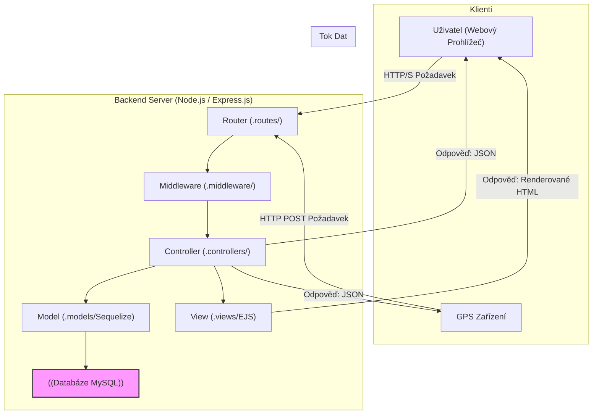
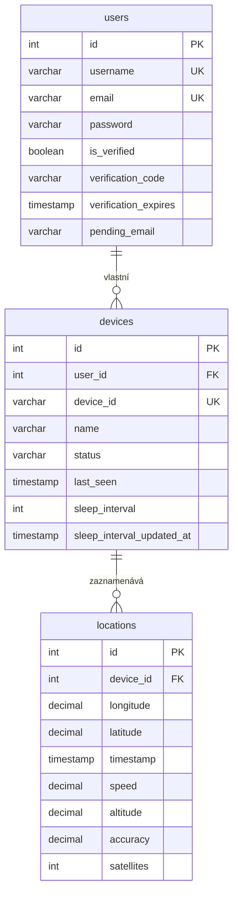

# Rozšířená Analýza a Dokumentace Serveru

Tento dokument poskytuje hloubkovou technickou analýzu a dokumentaci k serverové části aplikace pro sledování GPS. Popisuje architekturu, datový model, API endpointy a klíčové funkcionality systému.

## 1. Přehled

Server je postaven na platformě **Node.js** s využitím frameworku **Express.js**. Jeho primárním úkolem je sloužit jako backend pro GPS sledovací systém. Zajišťuje příjem a zpracování dat z GPS zařízení, správu uživatelských účtů a zařízení, a poskytuje rozhraní pro vizualizaci a management dat.

### 1.1. Technologický Stack

- **Backend:** Node.js, Express.js
- **Databáze:** MySQL
- **ORM (Object-Relational Mapping):** Sequelize
- **Šablonovací systém:** EJS (Embedded JavaScript templates)
- **Autentizace:** Express Session, bcryptjs pro hashování hesel
- **Validace:** express-validator
- **Odesílání e-mailů:** Nodemailer
- **Vývojové prostředí:** Nodemon pro automatické restartování serveru

## 2. Architektura a Tok Dat

Aplikace dodržuje osvědčený vzor Model-View-Controller (MVC), který odděluje datovou logiku, prezentační vrstvu a řídící logiku.

### 2.1. Diagram Architektury



### 2.2. Popis Toku Požadavku

1.  **Požadavek:** Klient (prohlížeč nebo GPS zařízení) odešle HTTP požadavek na server.
2.  **Router (`routes/`):** Express router na základě URL a HTTP metody identifikuje, která routa má být zpracována.
3.  **Middleware (`middleware/`):** Požadavek prochází přes sérii middleware funkcí:
    - **Autorizace (`authorization.js`):** Ověřuje, zda je uživatel přihlášen (`isAuthenticated`) a má potřebná oprávnění (`isUser`, `isRoot`).
    - **Validace (`validators.js`):** Kontroluje a sanitizuje vstupní data z těla požadavku (např. souřadnice, ID zařízení) pomocí `express-validator`.
    - **Další middleware:** Správa session, flash zprávy, rate limiting.
4.  **Controller (`controllers/`):** Pokud požadavek projde middlewarem, je předán příslušnému controlleru, který obsahuje hlavní aplikační logiku.
5.  **Model (`models/`):** Controller komunikuje s databází prostřednictvím Sequelize modelů, které abstrahují databázové tabulky a umožňují provádět CRUD operace.
6.  **Odpověď:**
    - Pro webové rozhraní controller předá data **View (`views/`)**, které vygeneruje HTML stránku a odešle ji zpět prohlížeči.
    - Pro API endpointy controller vrátí odpověď ve formátu JSON.

## 3. Databázové Schéma

Databáze je navržena pro efektivní ukládání uživatelů, jejich zařízení a historických dat o poloze.



- **Vztahy:**
  - `users` 1--N `devices`: Jeden uživatel může vlastnit více zařízení.
  - `devices` 1--N `locations`: Jedno zařízení může mít mnoho záznamů o poloze.
- **Kaskádové mazání:** Díky `ON DELETE CASCADE` se při smazání uživatele automaticky smažou všechna jeho zařízení a jejich polohová data. Stejně tak při smazání zařízení se smažou jeho data.

## 4. Detailní Popis Modulů

### 4.1. `controllers/`

- **`authController.js`:** Zpracovává veškerou logiku spojenou s autentizací: registrace, přihlášení, odhlášení, a proces ověření e-mailu (jak při registraci, tak při jeho změně).
- **`deviceController.js`:** Obsahuje logiku pro správu zařízení. Zpracovává příjem dat z GPS trackerů (`handleDeviceInput`), poskytuje data pro frontend (mapu), umožňuje registraci a mazání zařízení a nastavování `sleep_interval`.
- **`settingsController.js`:** Umožňuje přihlášeným uživatelům měnit své jméno, heslo, e-mail a smazat svůj účet.
- **`administrationController.js`:** Poskytuje rozhraní pro administrátora (`root`) pro správu všech uživatelů a zařízení v systému.
- **`indexController.js`:** Zobrazuje hlavní stránku (mapu) pro přihlášené uživatele.

### 4.2. `middleware/`

- **`authorization.js`:** Klíčový pro bezpečnost. Definuje tři úrovně přístupu:
  - `isAuthenticated`: Přístup pouze pro přihlášené uživatele.
  - `isUser`: Přístup pouze pro běžné (ne-root) uživatele.
  - `isRoot`: Přístup pouze pro administrátora.
- **`validators.js`:** Zajišťuje integritu dat. Definuje pravidla pro validaci dat přicházejících z GPS zařízení (`validateCoordinates`) a z nastavení zařízení (`validateSleepInterval`).

### 4.3. `routes/`

Definuje všechny dostupné API endpointy a přiřazuje je k příslušným controllerům a middleware. Struktura rout je přehledná a odpovídá jednotlivým modulům aplikace (auth, devices, settings, atd.).

### 4.4. `utils/`

- **`emailSender.js`:** Abstrahuje logiku pro odesílání e-mailů pomocí **Nodemailer**. V současnosti je nakonfigurován pro použití služby Gmail. Obsahuje funkci `sendVerificationEmail` pro odeslání ověřovacího kódu.

## 5. API Endpointy

Server poskytuje dvě hlavní kategorie endpointů: **Webové routy** pro zobrazování stránek a **API routy** pro datovou komunikaci.

### 5.1. API Routy (`/api/...`)

Tyto endpointy slouží pro komunikaci s webovým frontendem, mobilní aplikací a HW zařízeními. Vracejí data ve formátu JSON.

| Metoda | Endpoint                               | Popis                                                                 | Oprávnění         |
| :----- | :------------------------------------- | :-------------------------------------------------------------------- | :---------------- |
| POST   | `/api/auth/login`                      | Přihlášení uživatele.                                                 | Veřejné           |
| POST   | `/api/auth/register`                   | Registrace nového uživatele.                                          | Veřejné           |
| GET    | `/api/auth/logout`                     | Odhlášení uživatele.                                                  | `isAuthenticated` |
| POST   | `/api/devices/input`                   | Příjem dat z GPS zařízení.                                            | Veřejné           |
| GET    | `/api/devices/coordinates`             | Získá poslední známé souřadnice všech aktivních zařízení uživatele.    | `isUser`          |
| GET    | `/api/devices/data?id=<deviceId>`      | Získá historii polohy pro specifické zařízení.                         | `isUser`          |
| GET    | `/api/devices/settings/:deviceId`      | Získá nastavení pro specifické zařízení.                              | `isUser`          |
| POST   | `/api/devices/settings`                | Aktualizuje `sleep_interval` pro zařízení.                            | `isUser`          |
| POST   | `/api/devices/delete/:deviceId`        | Smaže specifické zařízení.                                            | `isUser`          |
| POST   | `/api/settings/username`               | Změna uživatelského jména.                                            | `isUser`          |
| POST   | `/api/settings/password`               | Změna hesla.                                                          | `isUser`          |
| POST   | `/api/settings/email`                  | Zahájení procesu změny e-mailu.                                       | `isUser`          |
| POST   | `/api/settings/delete-account`         | Smaže účet přihlášeného uživatele.                                     | `isUser`          |
| POST   | `/api/admin/delete-user/:userId`       | Smaže uživatele a všechna jeho data.                                  | `isRoot`          |
| POST   | `/api/admin/delete-device/:deviceId`   | Smaže zařízení a všechna jeho data (administrátor).                   | `isRoot`          |
| POST   | `/api/apk/login`                       | Přihlášení pro mobilní aplikaci.                                      | Veřejné           |
| POST   | `/api/apk/register-device`             | Registrace zařízení z mobilní aplikace.                               | `isAuthenticated` |

### 5.2. Webové Routy (`/`)

Tyto routy slouží k zobrazení stránek v prohlížeči.

| Metoda | Endpoint             | Popis                               | Oprávnění         |
| :----- | :------------------- | :---------------------------------- | :---------------- |
| GET    | `/`                  | Zobrazí hlavní stránku s mapou.     | `isAuthenticated` |
| GET    | `/login`             | Zobrazí přihlašovací stránku.       | Veřejné           |
| GET    | `/register`          | Zobrazí registrační stránku.        | Veřejné           |
| GET    | `/devices`           | Zobrazí stránku pro správu zařízení.| `isUser`          |
| GET    | `/register-device`   | Zobrazí stránku pro registraci nového zařízení. | `isUser`          |
| GET    | `/settings`          | Zobrazí stránku s nastavením účtu.  | `isUser`          |
| GET    | `/administration`    | Zobrazí administrátorskou stránku.  | `isRoot`          |

## 6. Spuštění a Nasazení

Pro spuštění serveru v lokálním vývojovém prostředí je doporučeno použít `nodemon` pro automatické restartování při změnách v kódu.

```bash
# Instalace závislostí
npm install

# Vytvoření .env souboru (zkopírujte .env.example a vyplňte)
cp .env.example .env

# Spuštění v development módu
npm run dev

# Spuštění v produkčním módu
npm start
```

Pro produkční nasazení je připraven `Dockerfile` a `docker-compose.yml`, které umožňují snadné spuštění aplikace v kontejneru.