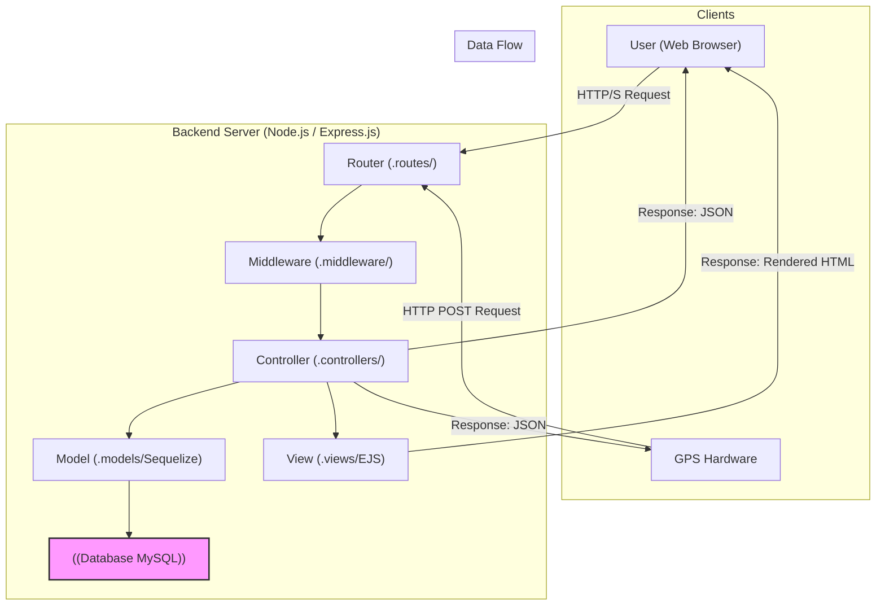

# Server Documentation

Tento dokument poskytuje hloubkovou technickou analýzu a dokumentaci k serverové části aplikace pro sledování GPS. Popisuje architekturu, datový model, API endpointy a klíčové funkcionality systému.

## 1. Overview

Server je postaven na platformě **Node.js** s využitím frameworku **Express.js**. Jeho primárním úkolem je sloužit jako backend pro GPS sledovací systém. Zajišťuje příjem a zpracování dat z GPS zařízení, správu uživatelských účtů a zařízení, a poskytuje rozhraní pro vizualizaci a management dat.

### 1.1. Technology Stack

- **Backend:** Node.js, Express.js
- **Database:** MySQL
- **ORM (Object-Relational Mapping):** Sequelize
- **Template Engine:** EJS (Embedded JavaScript templates)
- **Authentication:** Express Session, bcryptjs for password hashing
- **Validation:** express-validator
- **Emailing:** Nodemailer
- **Development:** Nodemon for automatic server restarts

## 2. Architecture and Data Flow

Aplikace dodržuje osvědčený vzor Model-View-Controller (MVC), který odděluje datovou logiku, prezentační vrstvu a řídící logiku.

### 2.1. Architecture Diagram



## 3. Database Schema


- **Relationships:**
  - `users` 1--N `devices`: One user can own multiple devices.
  - `devices` 1--N `locations`: One device can have many location records.
- **Cascade Deletion:** Thanks to `ON DELETE CASCADE`, deleting a user automatically deletes all their devices and associated location data.

## 4. Module Descriptions

- **`controllers/`**: Contains application logic for authentication, device management, user settings, administration, and the main page.
- **`middleware/`**: Handles authorization (`isAuthenticated`, `isUser`, `isRoot`) and input data validation.
- **`routes/`**: Defines all available endpoints and maps them to the corresponding controllers.
- **`utils/`**: Utility modules, such as `emailSender.js` for sending emails.

## 5. API Endpoints

### 5.1. Web Routes

| Method | Endpoint | Description | Permissions |
| :--- | :--- | :--- | :--- |
| GET | `/` | Main page with the map. | `isAuthenticated` |
| GET | `/login` | Login page. | Public |
| GET | `/register` | Registration page. | Public |
| GET | `/devices` | Device management page. | `isUser` |
| GET | `/settings` | Account settings page. | `isUser` |
| GET | `/administration` | Administration page. | `isRoot` |

### 5.2. General API Routes (`/api/...`)

| Method | Endpoint | Description | Permissions |
| :--- | :--- | :--- | :--- |
| POST | `/api/auth/login` | Logs in a user. | Public |
| POST | `/api/auth/register` | Registers a new user. | Public |
| GET | `/api/auth/logout` | Logs out a user. | `isAuthenticated` |
| POST | `/api/devices/input` | Receives data from a GPS device (HW or App). | Public |
| GET | `/api/devices/coordinates`| Gets the last coordinates for the user's devices.| `isUser` |
| GET | `/api/devices/data?id=<deviceId>`| Gets the location history for a device. | `isUser` |
| POST | `/api/devices/settings` | Updates the `sleep_interval` for a device. | `isUser` |
| POST | `/api/settings/username` | Changes the username. | `isUser` |
| POST | `/api/settings/password` | Changes the password. | `isUser` |

### 5.3. Hardware API Routes (`/api/hw/...`)

| Method | Endpoint | Description | Permissions |
| :--- | :--- | :--- | :--- |
| POST | `/api/hw/register-device` | Registers a hardware device to a user account. | Public |

## 6. Deployment

### 6.1. Environment Variables

The application is configured via environment variables, typically set within the `docker-compose.yml` file.

| Variable | Description | Example from `docker-compose.yml` |
| :--- | :--- | :--- |
| `PORT` | The port on which the Node.js application will run. | `5000` |
| `DB_HOST` | Hostname of the MySQL database service. | `mysql` |
| `DB_USER` | Database user. | `root` |
| `DB_PASSWORD` | Database user's password. | `root` |
| `DB_NAME` | The name of the database to use. | `gps_tracking` |
| `SESSION_SECRET` | A secret key for signing the session ID cookie. **Should be changed to a long, random string in production.** | `super_tajny_klic_pro_session` |
| `EMAIL_USER` | Username for the email sending service (e.g., Gmail). | *(Not set)* |
| `EMAIL_PASS` | Password for the email sending service. | *(Not set)* |
| `CORS_ORIGIN` | CORS origin policy. | `*` |

**Note on Email:** Email credentials (`EMAIL_USER`, `EMAIL_PASS`) are currently hard-coded in `utils/emailSender.js`. For production, they must be moved to environment variables.

### 6.2. Installation and Launch

The project is designed to be run with Docker.

```bash
# 1. Build and run the services in detached mode
docker-compose up --build -d

# 2. View logs
docker-compose logs -f app

# 3. Stop services
docker-compose down
```

---