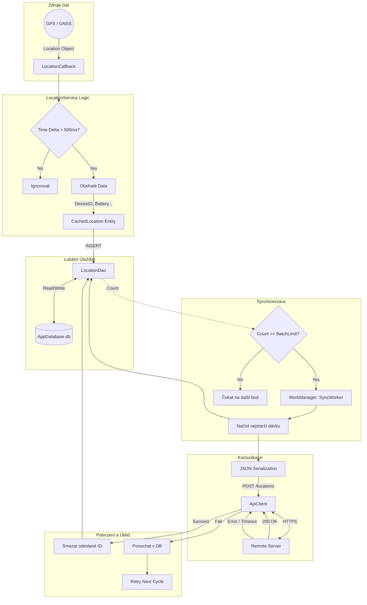

# Data Flow Diagram (DFD) - GPS Reporter APK

Tento diagram znázorňuje tok dat aplikací na principu **"Store-and-Forward"**.

```mermaid
flowchart TD
    subgraph Hardware [Zdroje Dat]
        GPS((GPS / GNSS)) -->|Location Object| Callback[LocationCallback]
    end

    subgraph Service [LocationService Logic]
        Callback --> Dedupe{"Time Delta > 500ms?"}
        Dedupe -- No --> Discard[Ignorovat]
        Dedupe -- Yes --> Enrich[Obohatit Data]
        
        Enrich -->|DeviceID, Battery...| Model[CachedLocation Entity]
    end

    subgraph Persistence [Lokální Úložiště]
        Model -->|INSERT| DAO[LocationDao]
        DAO <-->|Read/Write| SQLite[(AppDatabase.db)]
    end

    subgraph SyncLogic [Synchronizace]
        CheckTrigger{"Count >= BatchLimit?"}
        DAO -.->|Count| CheckTrigger
        
        CheckTrigger -- Yes --> Enqueue[WorkManager: SyncWorker]
        CheckTrigger -- No --> Wait[Čekat na další bod]
        
        Enqueue --> LoadBatch[Načíst nejstarší dávku]
        LoadBatch --> DAO
    end

    subgraph Network [Komunikace]
        LoadBatch --> Serialize[JSON Serialization]
        Serialize -->|POST /locations| Client[ApiClient]
        
        Client <-->|HTTPS| Server[Remote Server]
    end

    subgraph Cleanup [Potvrzení a Úklid]
        Server -->|200 OK| Client
        Client -->|Success| DeleteBatch[Smazat odeslané ID]
        DeleteBatch --> DAO
        
        Server -->|Error / Timeout| Client
        Client -->|Fail| KeepData[Ponechat v DB]
        KeepData --> Retry[Retry Next Cycle]
    end
```
