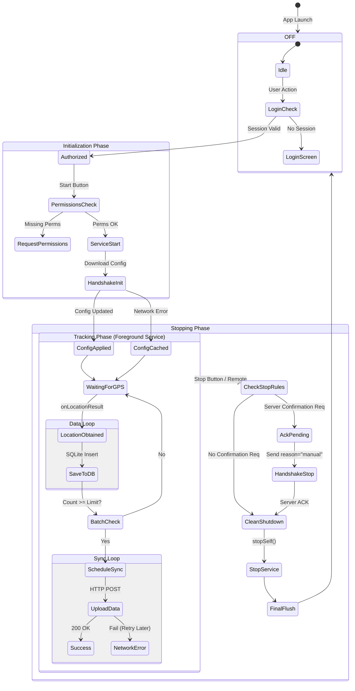

# State Diagram - GPS Reporter APK

Tento diagram znázorňuje životní cyklus služby `LocationService` a správu stavů napájení.

```mermaid
stateDiagram-v2
    [*] --> OFF: App Launch

    state OFF {
        [*] --> Idle
        Idle --> LoginCheck: User Action
        LoginCheck --> Authorized: Session Valid
        LoginCheck --> LoginScreen: No Session
    }

    state "Initialization Phase" as INIT {
        Authorized --> PermissionsCheck: Start Button
        PermissionsCheck --> RequestPermissions: Missing Perms
        PermissionsCheck --> ServiceStart: Perms OK
        ServiceStart --> HandshakeInit: Download Config
        HandshakeInit --> ConfigApplied: Config Updated
        HandshakeInit --> ConfigCached: Network Error
    }

    state "Tracking Phase (Foreground Service)" as TRACKING {
        ConfigApplied --> WaitingForGPS
        ConfigCached --> WaitingForGPS
        
        state "Data Loop" as DATA {
            WaitingForGPS --> LocationObtained: onLocationResult
            LocationObtained --> SaveToDB: SQLite Insert
            SaveToDB --> BatchCheck: Count >= Limit?
        }

        state "Sync Loop" as SYNC {
            BatchCheck --> ScheduleSync: Yes
            ScheduleSync --> UploadData: HTTP POST
            UploadData --> Success: 200 OK
            UploadData --> NetworkError: Fail (Retry Later)
        }
        
        BatchCheck --> WaitingForGPS: No
    }

    state "Stopping Phase" as STOPPING {
        TRACKING --> CheckStopRules: Stop Button / Remote
        CheckStopRules --> AckPending: Server Confirmation Req
        CheckStopRules --> CleanShutdown: No Confirmation Req
        
        AckPending --> HandshakeStop: Send reason="manual"
        HandshakeStop --> CleanShutdown: Server ACK
        
        CleanShutdown --> StopService: stopSelf()
        StopService --> FinalFlush
    }

    FinalFlush --> OFF
```