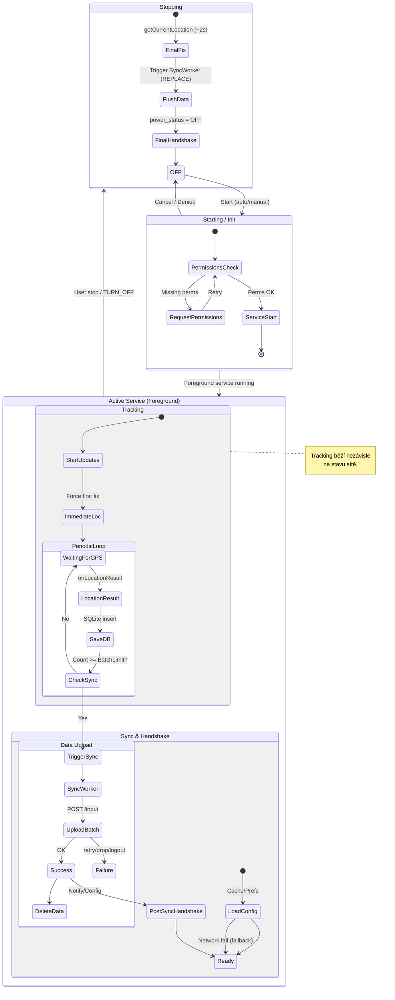

# State Diagram - GPS Reporter APK

```mermaid
stateDiagram-v2
    direction TB

    OFF --> STARTING: Start (auto/manual)

    state "Starting / Init" as STARTING {
        [*] --> PermissionsCheck
        PermissionsCheck --> RequestPermissions: Missing perms
        PermissionsCheck --> ServiceStart: Perms OK
        RequestPermissions --> PermissionsCheck: Retry
        ServiceStart --> [*]
    }

    STARTING --> SERVICE: Foreground service running
    STARTING --> OFF: Cancel / Denied

    state "Active Service (Foreground)" as SERVICE {
        direction LR

        state "Tracking" as TRACKING {
            [*] --> StartUpdates
            StartUpdates --> ImmediateLoc: Force first fix
            ImmediateLoc --> PeriodicLoop

            state PeriodicLoop {
                WaitingForGPS --> LocationResult: onLocationResult
                LocationResult --> SaveDB: SQLite insert
                SaveDB --> CheckSync: Count >= BatchLimit?
                CheckSync --> TriggerSync: Yes
                CheckSync --> WaitingForGPS: No
            }
        }

        state "Sync & Handshake" as SYNC {
            direction TB
            [*] --> LoadConfig: Cache/Prefs
            LoadConfig --> Ready
            LoadConfig --> Ready: Network fail (fallback)

            state "Data Upload" as UPLOAD {
                direction TB
                TriggerSync --> SyncWorker
                SyncWorker --> UploadBatch: POST /input
                UploadBatch --> Success: OK
                Success --> DeleteData
                Success --> PostSyncHandshake: Notify/Config
                UploadBatch --> Failure: retry/drop/logout
            }

            PostSyncHandshake --> Ready
        }

        note right of TRACKING
            Tracking běží nezávisle
            na stavu sítě.
        end note
    }

    SERVICE --> STOPPING: User stop / TURN_OFF

    state "Stopping" as STOPPING {
        direction TB
        [*] --> FinalFix: getCurrentLocation (~2s)
        FinalFix --> FlushData: Trigger SyncWorker (REPLACE)
        FlushData --> FinalHandshake: power_status = OFF
        FinalHandshake --> OFF
    }
```
