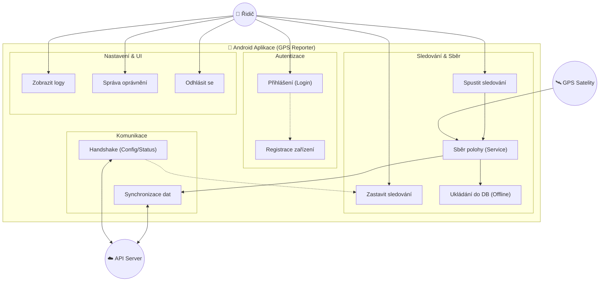

# Use Case Diagram - GPS Reporter APK

Přehled aktérů a funkčních bloků aplikace.

```mermaid
flowchart TD
    %% --- Actors ---
    Driver((👤 Řidič))
    GPS((🛰️ GPS Satelity))
    Server((☁️ API Server))

    %% --- System Boundary ---
    subgraph APK ["📱 Android Aplikace (GPS Reporter)"]
        direction TB

        subgraph Auth ["Autentizace"]
            UC_Login["Přihlášení (Login)"]
            UC_Register["Registrace zařízení"]
        end

        subgraph Tracking ["Sledování & Sběr"]
            UC_Start["Spustit sledování"]
            UC_Stop["Zastavit sledování"]
            UC_Collect["Sběr polohy (Service)"]
            UC_Cache["Ukládání do DB (Offline)"]
        end

        subgraph Comms ["Komunikace"]
            UC_Sync["Synchronizace dat"]
            UC_Handshake["Handshake (Config/Status)"]
        end

        subgraph Settings ["Nastavení & UI"]
            UC_Logs["Zobrazit logy"]
            UC_Perms["Správa oprávnění"]
            UC_Logout["Odhlásit se"]
        end
    end

    %% --- Relations ---
    Driver --> UC_Login
    Driver --> UC_Start
    Driver --> UC_Stop
    Driver --> UC_Logs
    Driver --> UC_Perms
    Driver --> UC_Logout

    UC_Login -.-> UC_Register
    UC_Start --> UC_Collect
    
    GPS --> UC_Collect
    UC_Collect --> UC_Cache
    UC_Collect --> UC_Sync
    
    UC_Sync <--> Server
    UC_Handshake <--> Server
    UC_Handshake -.-> UC_Stop
```
