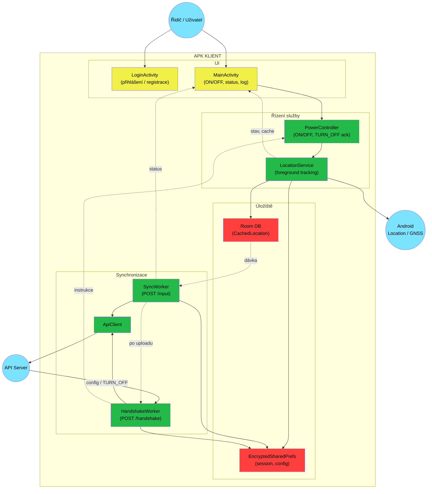

```mermaid
flowchart TD
    %% --- DEFINICE STYLŮ ---
    classDef actor fill:#7ce3ff;
    classDef system fill:#a8a8a8,stroke-dasharray: 5 5;
    classDef logic fill:#24ba49;
    classDef data fill:#ff3e3e;
    classDef ui fill:#f0f048;

    classDef default color:#000000;

    %% --- 1. AKTÉŘI (Actors) ---
    Driver((Řidič / Uživatel)):::actor
    GPSProvider((Android<br>Location / GNSS)):::actor
    APIServer((API Server)):::actor

    %% --- 2. SYSTÉM (APK CLIENT) ---
    subgraph APK ["APK KLIENT"]
        direction TB

        %% Uživatelské rozhraní
        subgraph UI ["UI"]
            Login["LoginActivity<br>(přihlášení / registrace)"]:::ui
            Main["MainActivity<br>(ON/OFF, status, log)"]:::ui
        end

        %% Řízení napájení a služby
        subgraph Control ["Řízení služby"]
            PowerCtl["PowerController<br>(ON/OFF, TURN_OFF ack)"]:::logic
            LocSvc["LocationService<br>(foreground tracking)"]:::logic
        end

        %% Synchronizace a handshake
        subgraph Sync ["Synchronizace"]
            SyncW["SyncWorker<br>(POST /input)"]:::logic
            HsW["HandshakeWorker<br>(POST /handshake)"]:::logic
            ApiCli["ApiClient"]:::logic
        end

        %% Úložiště
        subgraph Storage ["Úložiště"]
            RoomDB["Room DB<br>(CachedLocation)"]:::data
            Prefs["EncryptedSharedPrefs<br>(session, config)"]:::data
        end
    end

    %% --- 3. TOKY ---
    %% Uživatelské akce
    Driver --> Login
    Driver --> Main
    Main --> PowerCtl
    PowerCtl --> LocSvc

    %% Sběr polohy
    LocSvc --> GPSProvider
    LocSvc --> RoomDB

    %% Upload a handshake
    SyncW --> ApiCli
    HsW --> ApiCli
    ApiCli --> APIServer
    APIServer -- "config / TURN_OFF" --> HsW
    SyncW -. "po uploadu" .-> HsW

    %% Persistované údaje
    LocSvc --> Prefs
    SyncW --> Prefs
    HsW --> Prefs

    %% Přenos do serveru
    RoomDB -. "dávka" .-> SyncW

    %% Zpětná vazba do UI
    LocSvc -. "stav, cache" .-> Main
    SyncW -. "status" .-> Main
    HsW -. "instrukce" .-> PowerCtl

    %% Třídy
    class Driver,GPSProvider,APIServer actor;
    class Login,Main ui;
    class PowerCtl,LocSvc,SyncW,HsW,ApiCli logic;
    class RoomDB,Prefs data;
```