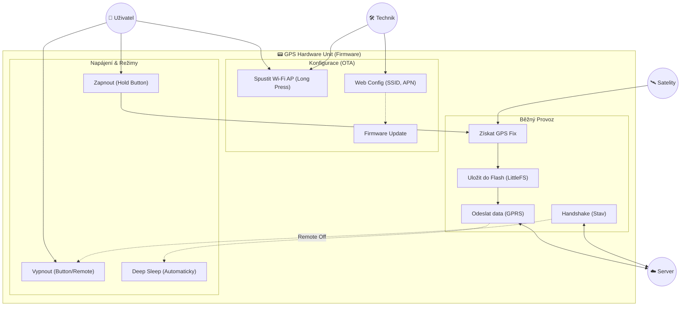

# Use Case Diagram - GPS Hardware (ESP32)

Přehled interakcí uživatele a systému s hardwarovou jednotkou.

```mermaid
flowchart TD
    %% --- Actors ---
    User((👤 Uživatel))
    Admin((🛠️ Technik))
    Server((☁️ Server))
    Satellites((🛰️ Satelity))

    %% --- System Boundary ---
    subgraph Device ["📟 GPS Hardware Unit (Firmware)"]
        direction TB
        
        subgraph PowerMgmt ["Napájení & Režimy"]
            UC_PowerOn["Zapnout (Hold Button)"]
            UC_PowerOff["Vypnout (Button/Remote)"]
            UC_Sleep["Deep Sleep (Automaticky)"]
        end

        subgraph Config ["Konfigurace (OTA)"]
            UC_WifiAP["Spustit Wi-Fi AP (Long Press)"]
            UC_WebConfig["Web Config (SSID, APN)"]
            UC_OTA["Firmware Update"]
        end

        subgraph Operation ["Běžný Provoz"]
            UC_Fix["Získat GPS Fix"]
            UC_Cache["Uložit do Flash (LittleFS)"]
            UC_Upload["Odeslat data (GPRS)"]
            UC_Handshake["Handshake (Stav)"]
        end
    end

    %% --- Relations ---
    User --> UC_PowerOn
    User --> UC_PowerOff
    User --> UC_WifiAP
    
    Admin --> UC_WifiAP
    Admin --> UC_WebConfig
    UC_WebConfig -.-> UC_OTA

    UC_PowerOn --> UC_Fix
    
    Satellites --> UC_Fix
    UC_Fix --> UC_Cache
    UC_Cache --> UC_Upload
    
    UC_Upload <--> Server
    UC_Handshake <--> Server
    
    UC_Handshake -.->|Remote Off| UC_PowerOff
    UC_Upload -.-> UC_Sleep
```
