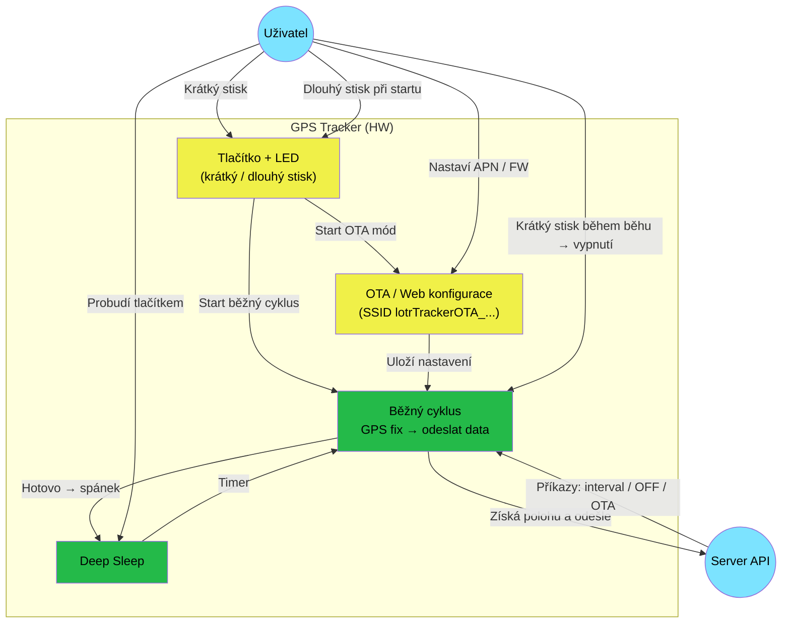

# Use Case Diagram – GPS Tracker (HW)

```mermaid
flowchart TD
    %% --- STYLY (shodné se server USE CASE) ---
    classDef actor fill:#7ce3ff;
    classDef system fill:#a8a8a8,stroke-dasharray: 5 5;
    classDef logic fill:#24ba49;
    classDef data fill:#ff3e3e;
    classDef ui fill:#f0f048;
    classDef default color:#000000;

    %% --- AKTÉŘI ---
    User((Uživatel)):::actor
    Server((Server API)):::actor

    %% --- SYSTÉM: CO UŽIVATEL VIDÍ ---
    subgraph Tracker ["GPS Tracker (HW)"]
        direction TB
        ButtonLED["Tlačítko + LED\n(krátký / dlouhý stisk)"]:::ui
        WebUI["OTA / Web konfigurace\n(SSID lotrTrackerOTA_...)"]:::ui
        Cycle["Běžný cyklus\nGPS fix → odeslat data"]:::logic
        Sleep["Deep Sleep"]:::logic
    end

    %% --- TOKY VIDITELNÉ UŽIVATELI ---
    User -->|Krátký stisk| ButtonLED
    User -->|Dlouhý stisk při startu| ButtonLED

    ButtonLED -->|Start běžný cyklus| Cycle
    ButtonLED -->|Start OTA mód| WebUI

    User -->|Nastaví APN / FW| WebUI
    WebUI -->|Uloží nastavení| Cycle

    Cycle -->|Získá polohu a odešle| Server
    Server -->|Příkazy: interval / OFF / OTA| Cycle
    Cycle -->|Hotovo → spánek| Sleep
    Sleep -->|Timer| Cycle
    User -->|Probudí tlačítkem| Sleep

    %% Vypnutí během běhu
    User -->|Krátký stisk během běhu → vypnutí| Cycle
```
