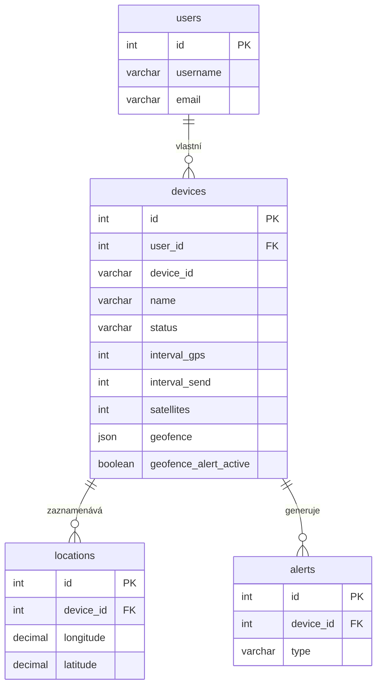

# 2. Databáze

Tento dokument popisuje datovou vrstvu aplikace: použitou technologii, hlavní modely, vztahy a provozní poznámky. Detailní ER diagramy jsou v `db_diagrams/` a referenční SQL vzory v `docs_server/schemas/`.

## Použité technologie

- Systém: MySQL
- ORM: Sequelize
- Inicializace: primárně je v repozitáři dodán `init-db.sql` (viz kořen projektu). V runtime `database.js` volá `sequelize.sync({ alter: true })` pro synchronizaci schématu při spuštění — to je užitečné pro vývoj, avšak pro produkční nasazení se doporučují verzované migrace.

Poznámka: Dokumentace dříve odkazovala na `docs_server/schemas/` — canonical source schémat v tomto projektu jsou Sequelize modely (`models/*.js`) a případně `init-db.sql`. Pokud plánujete produkční provoz, zaveďte řízené migrace místo automatického `sync({ alter: true })`.

## Hlavní modely (stručně)

Podrobné popisy polí a validací jsou v souborech modelů (`models/`). Níže je souhrn klíčových entit a jejich účelu.

- `User` (`models/user.js`): uživatelské účty, ověření e‑mailu, záznamy o poskytovateli identity (OAuth). Citlivá pole (hash hesla, tokeny) musí být ukládána bezpečně.
- `Device` (`models/device.js`): metadata o zařízeních (HW / APK), vlastnictví (`user_id`), provozní konfigurace (`interval_gps`, `interval_send`, `mode`) a nastavení geofence (uloženo jako JSON/GeoJSON).
- `Location` (`models/location.js`): historické záznamy poloh s poli `latitude`, `longitude`, `timestamp`, `speed`, `accuracy` a doplňujícími telemetrickými hodnotami.
- `Alert` (`models/alert.js`): záznamy o vygenerovaných poplachech (typ, zpráva, stav přečtení).

Další pomocné modely mohou zahrnovat `Session`, `DeviceConfig` nebo `UploadLog` pro monitorování příjmů dat.

## Asociace a integrita

- `User` 1 : N `Device` — vlastnictví zařízení.
- `Device` 1 : N `Location` — zařízení má mnoho polohových záznamů.
- `Device` 1 : N `Alert` — zařízení může generovat více poplachů.

Integritu vztahů zajišťují cizí klíče a v některých případech kaskádové mazání (`ON DELETE CASCADE`). Pro hromadné operace se doporučuje používat transakce, aby nedošlo k inkonzistencím.

ER diagram (referenční) je v `db_diagrams/` — pokud potřebujete rychlý přehled, otevřete `db_diagrams/Untitled Diagram_2025-11-10T10_47_17.693Z.sql` nebo odpovídající PNG/PDF.

## Výkon a indexování

- Indexovat často filtrovaná pole: `device_id`, `user_id`, `timestamp` (u `locations`).
- Partitioning: u velmi velkých tabulek (např. `locations`) zvažte partitioning podle datumu nebo `device_id` pro lepší výkon archivace a čtení.
- Archivace: stará data lze přesouvat do samostatných archivních tabulek nebo do datového skladu pro analytiku.

## Zálohování a obnova

- Zálohy databáze plánujte pravidelně (differential + full) s automatizovanou verifikací.
- Testujte obnovu z backupů v sandbox prostředí; ověřte konzistenci FK a integritních omezení po obnově.

## Provozní poznámky

- Po spuštění kontejneru se inicializační skript `init-db.sql` může použit pro naplnění základních dat.
- Migrace: používejte verzované migrace, zvláště při změnách schématu v produkci.
- Konfigurace připojení: `DB_HOST`, `DB_USER`, `DB_PASSWORD`, `DB_NAME` jsou definovány přes env proměnné a spravovány v `docker-compose.yml`.

---
Poslední aktualizace: 2025-11-18
# 2. Databáze

Tento dokument detailně popisuje databázové schéma, jednotlivé tabulky (modely) a jejich vzájemné vztahy.

## 2.1. Přehled

- **Systém**: MySQL
- **ORM**: Sequelize
- **Inicializace**: Schéma databáze a základní data jsou definovány v souboru `init-db.sql`, který se automaticky spouští při prvním startu `mysql` kontejneru v Dockeru.

## 2.2. Schéma a modely

Následuje popis jednotlivých tabulek a jejich reprezentace v Sequelize modelech.

### Tabulka `users`

Ukládá informace o uživatelských účtech.

- **Model**: `models/user.js`
- **Klíčové sloupce**:
  - `id`: Primární klíč (PK).
  - `username`, `email`: Unikátní identifikátory uživatele.
  - `password`: Hashované heslo pro lokální účty (u OAuth může být prázdné, dokud si uživatel nenastaví heslo).
  - `is_verified`: Flag, zda byl e-mail uživatele ověřen.
  - `verification_code`, `verification_expires`: Dočasný kód a jeho expirace pro ověření e‑mailu nebo specifické procesy.
  - `pending_email`: Dočasně uložený nový e‑mail čekající na ověření.
  - `provider`, `provider_id`, `provider_data`: Informace o přihlášení přes třetí strany (OAuth), např. `google` nebo `github`.
  - `deletion_code`, `deletion_code_expires`: Kód a expirace pro potvrzení smazání účtu.

### Tabulka `devices`

Obsahuje informace o registrovaných GPS zařízeních.

- **Model**: `models/device.js`
- **Klíčové sloupce**:
  - `id`: Primární klíč (PK).
  - `user_id`: Cizí klíč (FK) odkazující na `users.id`. Určuje, komu zařízení patří.
  - `device_id`: Unikátní identifikátor zařízení (řetězec). V databázi je definován jako `VARCHAR(255)` (viz `init-db.sql`), proto aplikace akceptuje delší ID — doporučuje se používat konzistentní formát (HW ID nebo instalacní ID pro APK).
  - `name`: Uživatelsky definovaný název zařízení.
  - `status`: Stav zařízení (`active`, `inactive`).
  - `last_seen`: Poslední časová značka, kdy zařízení odeslalo data.
  - `power_status`: Stav napájení hlášený zařízením (`ON`, `OFF`).
  - `power_instruction`: Instrukce pro zařízení k vypnutí (`NONE`, `TURN_OFF`).
  - `interval_gps`, `interval_send`, `satellites`: Konfigurace intervalů a minimální počet satelitů pro fix (HW).
  - `mode`: Režim odesílání dat (`simple`, `batch`).
  - `geofence`: JSON pro uložení ohrady (podporuje GeoJSON polygon i vlastní typ `circle`).
  - `geofence_alert_active`: Interní příznak, zda je aktivní „mimo geofence“ stav.
  - `device_type`: Typ klienta/zařízení (`HW`, `APK`).
  - `created_at`: Datum registrace zařízení.

### Tabulka `locations`

Ukládá jednotlivé záznamy o poloze z GPS zařízení.

- **Model**: `models/location.js`
- **Klíčové sloupce**:
  - `id`: Primární klíč (PK).
  - `device_id`: Cizí klíč (FK) odkazující na `devices.id`.
  - `longitude`, `latitude`: Zeměpisné souřadnice.
  - `timestamp`: Časová značka záznamu.
  - `speed`, `altitude`, `accuracy`, `satellites`: Doplňující data z GPS modulu.

### Tabulka `alerts`

Záznamy o vygenerovaných poplaších (např. při opuštění geofence).

- **Model**: `models/alert.js`
- **Klíčové sloupce**:
  - `id`: Primární klíč (PK).
  - `device_id`: Cizí klíč (FK) odkazující na `devices.id`.
  - `type`: Typ poplachu (např. `geofence`).
  - `message`: Text poplachu.
  - `is_read`: Flag, zda si uživatel poplach přečetl.

## 2.3. Vztahy mezi modely (Asociace)

Vztahy jsou definovány v `associate` metodách jednotlivých modelů a zajišťují integritu dat. Kód někdy provádí i ruční mazání závislých záznamů v transakcích (např. při mazání zařízení), i když databáze má také `ON DELETE CASCADE`.

## 2.4. Inicializační SQL a root uživatel

Soubor `init-db.sql` v kořeni projektu obsahuje SQL pro vytvoření databáze, tabulek a indexů. Skript rovněž obsahuje ukázkový záznam pro uživatele `root`. Poznámka: repozitář momentálně neobsahuje specializovaný `seed-root` skript; pokud chcete bezpečně vytvořit root uživatele, upravte `init-db.sql` nebo vytvořte jednoduchý seed skript.

- **`User` 1 : N `Device`**: Jeden uživatel může vlastnit více zařízení.
- **`Device` 1 : N `Location`**: Jedno zařízení může mít mnoho záznamů o poloze.
- **`Device` 1 : N `Alert`**: K jednomu zařízení se může vázat více poplachů.

**Kaskádové mazání (`ON DELETE CASCADE`)**: Při smazání uživatele se kaskádově smažou i jeho zařízení a následně jejich lokace a poplachy. V některých operacích (např. mazání zařízení administrátorem) se pro jistotu provádí ruční mazání závislých záznamů v transakci.
