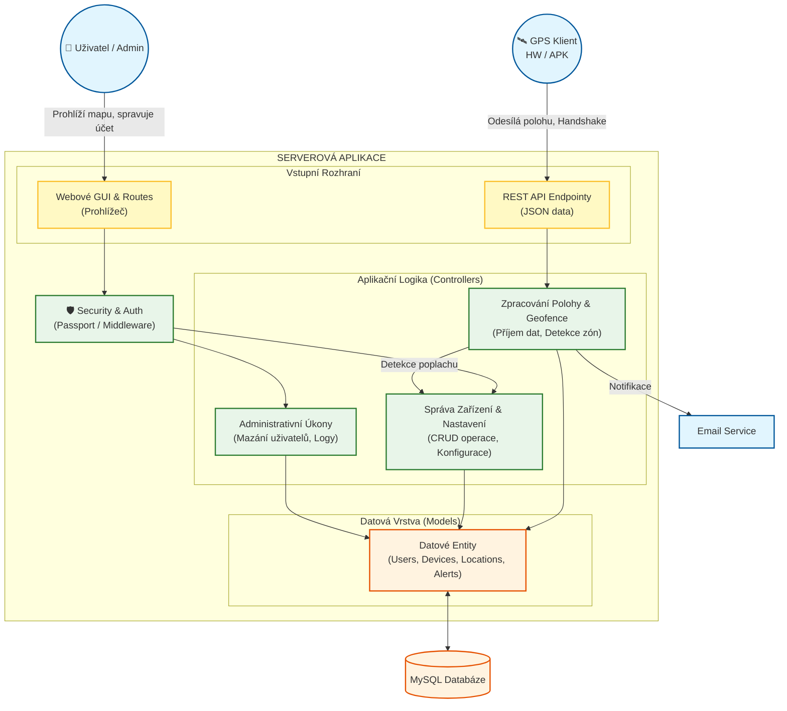

```mermaid
flowchart TD
    %% --- DEFINICE STYLŮ ---
    classDef actor fill:#e1f5fe,stroke:#01579b,stroke-width:2px;
    classDef system fill:#fff,stroke:#333,stroke-width:2px,stroke-dasharray: 5 5;
    classDef logic fill:#e8f5e9,stroke:#2e7d32,stroke-width:2px;
    classDef data fill:#fff3e0,stroke:#e65100,stroke-width:2px;
    classDef ui fill:#fff9c4,stroke:#fbc02d,stroke-width:2px;

    %% --- 1. AKTÉŘI (Actors) ---
    User((👤 Uživatel / Admin)):::actor
    Device((🛰️ GPS Klient<br>HW / APK)):::actor

    %% --- 2. SYSTÉM (Node.js Server) ---
    subgraph System ["SERVEROVÁ APLIKACE"]
        direction TB

        %% Prezentační Vrstva (Vstup)
        subgraph Interface ["Vstupní Rozhraní"]
            WebUI["Webové GUI & Routes<br>(Prohlížeč)"]:::ui
            API["REST API Endpointy<br>(JSON data)"]:::ui
        end

        %% Bezpečnost
        AuthBlock["🛡️ Security & Auth<br>(Passport / Middleware)"]:::logic

        %% Aplikační Logika (Sloučené Controllery)
        subgraph BusinessLogic ["Aplikační Logika (Controllers)"]
            Logic_Tracking["Zpracování Polohy & Geofence<br>(Příjem dat, Detekce zón)"]:::logic
            Logic_Mgmt["Správa Zařízení & Nastavení<br>(CRUD operace, Konfigurace)"]:::logic
            Logic_Admin["Administrativní Úkony<br>(Mazání uživatelů, Logy)"]:::logic
        end

        %% Datová Vrstva (Sloučené Modely)
        subgraph DataLayer ["Datová Vrstva (Models)"]
            Entities["Datové Entity<br>(Users, Devices, Locations, Alerts)"]:::data
        end
        
    end

    %% --- 3. EXTERNÍ ZDROJE ---
    DB[("MySQL Databáze")]:::data
    Mail["Email Service"]:::actor

    %% --- VZTAHY A TOKY ---

    %% Interakce Uživatele (Use Cases)
    User -- "Prohlíží mapu, spravuje účet" --> WebUI
    WebUI --> AuthBlock
    AuthBlock --> Logic_Mgmt
    AuthBlock --> Logic_Admin

    %% Interakce Zařízení (Use Cases)
    Device -- "Odesílá polohu, Handshake" --> API
    API --> Logic_Tracking
    
    %% Logické vazby
    Logic_Tracking -- "Detekce poplachu" --> Logic_Mgmt
    Logic_Tracking -- "Notifikace" --> Mail
    
    %% Tok do dat
    Logic_Tracking --> Entities
    Logic_Mgmt --> Entities
    Logic_Admin --> Entities

    %% Persistence
    Entities <--> DB

```