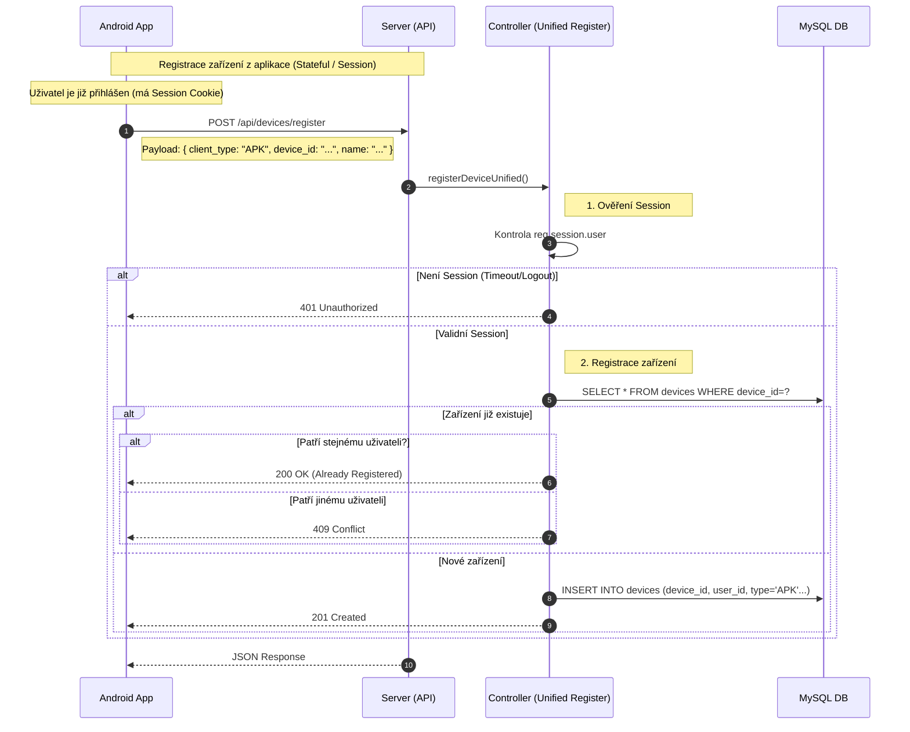

```mermaid
sequenceDiagram
    autonumber
    participant APK as Android App
    participant API as Server (API)
    participant Logic as Controller (Unified Register)
    participant DB as MySQL DB

    Note over APK, API: Registrace zařízení z aplikace (Stateful / Session)
    Note over APK: Uživatel je již přihlášen (má Session Cookie)

    APK->>API: POST /api/devices/register
    Note right of APK: Payload: { client_type: "APK", device_id: "...", name: "..." }
    
    API->>Logic: registerDeviceUnified()

    Note right of Logic: 1. Ověření Session
    Logic->>Logic: Kontrola req.session.user
    
    alt Není Session (Timeout/Logout)
        Logic-->>APK: 401 Unauthorized
    else Validní Session
        Note right of Logic: 2. Registrace zařízení
        Logic->>DB: SELECT * FROM devices WHERE device_id=?
        
        alt Zařízení již existuje
            alt Patří stejnému uživateli?
                Logic-->>APK: 200 OK (Already Registered)
            else Patří jinému uživateli
                Logic-->>APK: 409 Conflict
            end
        else Nové zařízení
            Logic->>DB: INSERT INTO devices (device_id, user_id, type='APK'...)
            Logic-->>APK: 201 Created
        end
    end
    API-->>APK: JSON Response
```