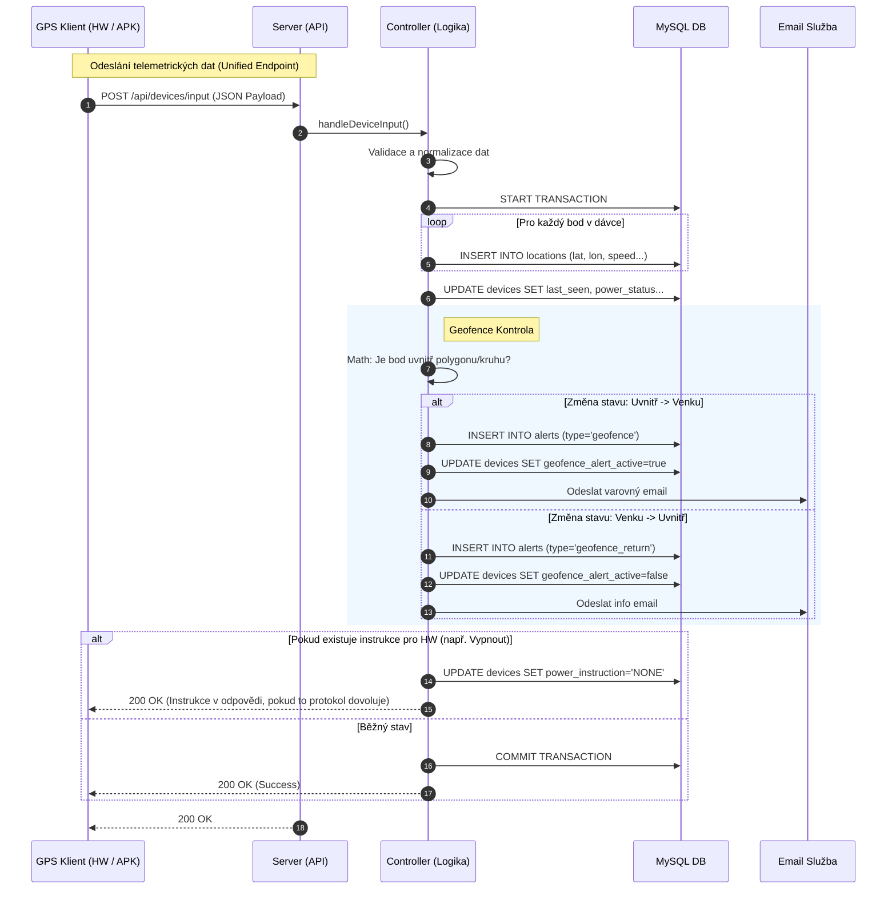

```mermaid
sequenceDiagram
    autonumber
    participant Client as GPS Klient (HW / APK)
    participant API as Server (API)
    participant Logic as Controller (Logika)
    participant DB as MySQL DB
    participant Mail as Email Služba

    Note over Client, API: Odeslání telemetrických dat (Unified Endpoint)

    Client->>API: POST /api/devices/input (JSON Payload)
    API->>Logic: handleDeviceInput()
    
    Logic->>Logic: Validace a normalizace dat
    
    Logic->>DB: START TRANSACTION
    
    loop Pro každý bod v dávce
        Logic->>DB: INSERT INTO locations (lat, lon, speed...)
    end

    Logic->>DB: UPDATE devices SET last_seen, power_status...
    
    rect rgb(240, 248, 255)
        Note right of Logic: Geofence Kontrola
        Logic->>Logic: Math: Je bod uvnitř polygonu/kruhu?
        
        alt Změna stavu: Uvnitř -> Venku
            Logic->>DB: INSERT INTO alerts (type='geofence')
            Logic->>DB: UPDATE devices SET geofence_alert_active=true
            Logic->>Mail: Odeslat varovný email
        else Změna stavu: Venku -> Uvnitř
            Logic->>DB: INSERT INTO alerts (type='geofence_return')
            Logic->>DB: UPDATE devices SET geofence_alert_active=false
            Logic->>Mail: Odeslat info email
        end
    end

    alt Pokud existuje instrukce pro HW (např. Vypnout)
        Logic->>DB: UPDATE devices SET power_instruction='NONE'
        Logic-->>Client: 200 OK (Instrukce v odpovědi, pokud to protokol dovoluje)
    else Běžný stav
        Logic->>DB: COMMIT TRANSACTION
        Logic-->>Client: 200 OK (Success)
    end
    
    API-->>Client: 200 OK
```